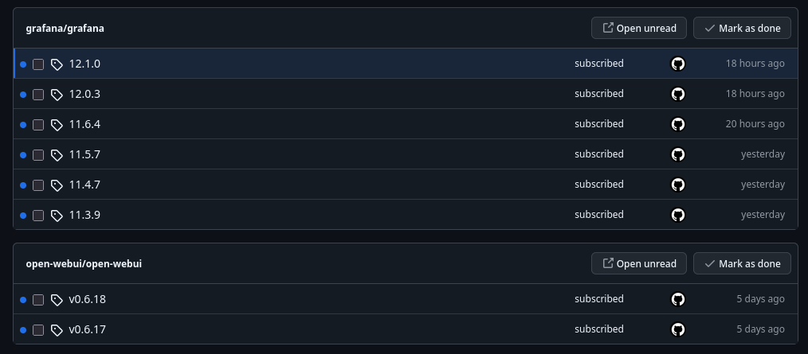

<!-- markdownlint-disable blanks-around-lists blanks-around-fences ol-prefix -->

A guide to deploy my home server stack on a Raspberry Pi.

## Disclaimer: This is a rough guide

This guide was made from memory and hadn't (yet) been fully tested.

Also, if you're not Mish, you might struggle to follow some of the steps (especially regarding security configuration) because this is intended as a guide for future me. The `rpi-docker-compose` repository is unfortunately not public. However, if you want to take inspiration from my setup, please do, and message me (Slack, email, Discord) because I'd be more than happy to give you some tips.

## Part 1: Installation and configuration

<!-- TODO backups to mish-arch?? -->
1. Install the latest Raspberry Pi OS Lite (64-bit) onto an SD card, with the following OS customization settings:
   - Hostname: `rpi`
   - Username: `rpi` and a password of your choice
   - Do not configure wireless LAN
   - Time zone "Europe/London" and keyboard layout "gb"
   - Enable SSH with public-key authentication
2. Ensure the `homelab-data-2` SSD is connected to the Pi (it's a Crucial BX500 1TB SSD).
   - Use a USB SATA enclosure (such as the one with date code `20231025`) because the simple USB-to-SATA adapters aren't reliable.
3. Install important sysadmin software, notably the `micro` text editor (and add `dust`, `lazygit`, `sysstat` and `btop` at some point)
4. Add the SSD to `/etc/fstab`:
```bash
LABEL="homelab-data-2" /mnt/data   ext4 defaults,rw,noatime,data=ordered 0 0
```
1. Apply the fstab changes with `sudo mount -a`
2. Increase swapfile size (this is mainly to prevent Immich's machine learning bringing down the system) in `/etc/dphys-swapfile`
```bash
CONF_SWAPFILE=/mnt/data/swapfile
CONF_SWAPSIZE=8192
CONF_MAXSWAP=8192
```
1. Apply the swapfile changes: `sudo dphys-swapfile {swapoff,setup,swapon}`
2. Install and set up PiVPN: <https://www.pivpn.io/>
3. Install `iperf3` (set it up to start on boot in server mode)
4. Install Docker: <https://docs.docker.com/engine/install/debian/#install-using-the-repository>
5. Install Git, configure it, and set up authentication via SSH
```ini
# git config -l
user.name=MMK21
user.email=50421330+MMK21Hub@users.noreply.github.com
core.editor=micro
```
```ssh
# cat ~/.ssh/config
Host github.com
  HostName github.com
  User git
  IdentityFile ~/.ssh/github
```
1. Clone the Docker compose files from Github: `git clone https://github.com/MMK21Hub/rpi-docker-compose.git ~/docker-compose-configs`
2. Add bash aliases for Docker and apt (`micro ~/.bashrc`, or you could put them in `~/.bash_aliases`):
```bash
alias dc='docker compose'
alias up='docker compose up -d'
alias dcp='docker compose pull && docker compose up -d'
alias aptu='sudo apt update && sudo apt upgrade'
```
1. Also, hoard Bash history lines
```bash
HISTSIZE=10000
HISTFILESIZE=10000
```
1. Install dependencies for bash scripts: `jq` and `age` (for encryption)
2. Get the Home Assistant Backup private key from Bitwarden and save it to `~/secrets/backup-passwords/home-assistant-db`
3. `chmod 400 ~/secrets/backup-passwords/home-assistant-db`
4. Set up user cron jobs (run `crontab -e`) (do *not* use `sudo`)
```bash
# crontab -l
@daily    crontab -l > $HOME/.crontab # backup crontab
0 2 * * * /bin/bash /home/pi/docker-compose-configs/backup-file-to-pomf.sh /mnt/data/terraria/worlds/ACMO-S4.wld.bak
0 2 * * * /bin/bash /home/pi/docker-compose-configs/home-assistant/upload-latest-backup.sh
```

## Part 2: Bringing it online

1. `cd ~/docker-compose-configs`
2. Bring up Caddy first becuase it has the definition for the `caddy-network` network (i.e. `cd caddy` and then `up`)
2. Bring up `victoria` (VictoriaMetrics) because quite a few things send/receive from it
3. Bring up the other services: `cloudflare-ddns`, `grafana`, `home-assistant`, `immich-app`, `netdata`, `open-webui`, `socks5`, `syncthing`, `terraria` (note that this list changes pretty frequently, so be sure to `ls ~/docker-compose-configs` to check if anything's been missed accidentally)
5. Check CPU/RAM usage with `btop`; check `df -h`
6. Use a web browser to test that services are running as expected

## Part 3: Installing scripts (optional)

My scripts in `~/scripts` are meant to be non-essential and temporary, but temporary solutions often inevitably become permanent, and it can be useful to have a way to restore them.

### Pull scripts from GitHub

```bash
cd ~
git clone git@github.com:MMK21Hub/rpi-scripts.git scripts
```

### Add scripts to crontab

Add the following line to the crontab (`crontab -e`):

```bash
* * * * * /home/pi/scripts/venv/bin/python /home/pi/scripts/mc_server_mon.py
```

## Keeping things up-to-date

### Updating Debian packages

You can update the OS and packages by running `aptu` (an alias that performs the standard update + upgrade incarnations).

Debian doesn't require frequent updating like Arch does, but it's good to make sure the latest security patches are installed. Therefore, I don't have a set update schedule, but I perform an update whenever that pops into my mind.

### Updating Docker services

Docker service stacks need to be updated individually when a new version is released. (This should probably be made automatic for some services in the future.) You can do it like this:

```bash
cd ~/docker-compose-configs/grafana/
dcp
```

The `dcp` alias pulls the latest images and then restarts the service.

When updating Immich, be sure to check the [release notes](https://github.com/immich-app/immich/releases) for breaking changes.

#### Use of GitHub notifications

So that I know when a new version of a service I use is released, I simply watch the relevant repositories on GitHub (releases only). It's low-tech, but has worked well so far.



I follow the following repos:

* <https://github.com/grafana/grafana>
* <https://github.com/open-webui/open-webui>
* <https://github.com/netdata/netdata>
